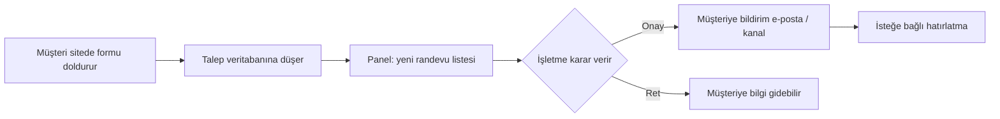

# Rezervasyon sistemi — sunum slaytları

*PowerPoint / Google Slides’a kopyalayın veya konuşma notu olarak kullanın. Teknik olmayan işletme sahibi veya yatırımcıya uygun dil.*

---

## Slayt 1 — Başlık

**Randevu / rezervasyon sistemi nasıl çalışıyor?**

Alt başlık: *Müşteri talebinden onaya kadar — tek ekrandan özet*

Konuşma notu: Bugün “telefonla değil, siteden talep + panelden yönetim” modelini anlatıyorum.

---

## Slayt 2 — Sorun → çözüm

| Eskiden | Bu sistemle |
|--------|-------------|
| Sürekli telefon, defter, kaçan randevu | Müşteri **7/24 formdan** talep bırakır |
| Hangi hizmet, hangi gün karışıyor | Tarih/saat ve hizmet **bilgisayarda net** |
| “Sizi ararız” demek zorunda kalma | Talep **kayıt altına** alınır |

Konuşma notu: Satış noktası: düzen + müşteri deneyimi + ölçülebilir kayıt.

---

## Slayt 3 — Üç taraf: kim ne yapıyor?

1. **Ziyaretçi / müşteri** — Sitede formu doldurur (tarih, iletişim, istenen hizmet).
2. **İşletme (salon, klinik vb.)** — Yönetim panelinden talepleri görür, **onaylar veya reddeder**.
3. **Siz (platform işletmesi)** — İsterseniz **yeni müşteri siteleri** açan merkez panel (`Müşteri siteleri`); her salon kendi alanından kendi işini yönetir.

Konuşma notu: “Tek yazılım, çok müşteri” varsa Slayt 4’e bağlayın; tek salon ise 3. maddeyi kısaltın.

---

## Slayt 4 — Uçtan uca randevu akışı (çekirdek hikâye)

**Beş adım (kısa):** Talep → Kayıt → Panel → Onay/Ret → Bildirim (ve bazen iptal/teyit linki).

---

## Slayt 5 — Yönetim panelinde neler var? (işletme perspektifi)

- **Randevular** — Takvim / liste, onay–ret, durumlar.
- **Personel planlama** — Uygunsa, personel ve müsaitlik ile uyumlu görünüm.
- **Genel ayarlar** — Site adı, tema, **bildirim e-postaları**, SMTP; randevuya düşen maillere kimlerin bakacağı.
- **Sayfalar & menü** — Sitede hangi metinler ve formlar görünsün.
- **CRM / talepler** — İletişim formundan gelen lead’ler (yapılandırmaya göre).

Konuşma notu: Her işletme kendi kutusunu görür; başka salona sızmaz (Slayt 6).

---

## Slayt 6 — “Bir program, çok işletme” (SaaS benzeri)

- Aynı uygulama kodu, paylaşılan veritabanı **sunucusu** — ama veriler **kiracı (tenant)** diye ayrı kutularda.
- Hangi **alan adından** (domain) girildiyse sistem o işletmenin **sayfalarını, ayarlarını ve randevularını** gösterir.

**Tek cümle:** *Aynı motor; her işletme kendi vitrininin arkasında kendi kutusu.*

---

## Slayt 7 — Bildirimler ve iletişim

- **E-posta:** Onay, ret, hatırlatma vb. — ayarlarda tanımlı SMTP ve alıcı listeleriyle.
- **Diğer kanallar:** Yapılandırmaya göre WhatsApp, Telegram gibi köprüler entegre edilebilir.
- **Linkler:** Mümkün olduğunca müşterinin **girdiği site adresine** uygun kök ile üretilir (doğru marka / doğru domain).

Konuşma notu: Otomatik görevlerde (ör. zamanlanmış hatırlatma) bazen sunucudaki **varsayılan kök adres** kullanılır — buna göre env seçilir.

---

## Slayt 8 — Güvenlik ve iptal (basit anlatım)

- Randevu ve müşteri verisi **işletmeye göre filtrelenir**; panel başka kiracının kaydına “rastgele” erişmez.
- İptal / özel bağlantılarda teknik olarak **güvenli token** kullanılır (detay müşteriye gerekmez: “linke tıklayınca doğru randevu bulunur”).

---

## Slayt 9 — Yeni bir site veya yeni alan adı

1. Domain DNS → barındırma (ör. Vercel)  
2. Projede **Custom domain**  
3. Veritabanında **o alan adı → doğru kiracı** kaydı  
4. İçerik: şablon kopyalama veya elle doldurma  

**Merkez panelde** “Müşteri siteleri” varsa: yeni kiracı ve ilk domain çoğu zaman **tek formdan** açılabilir.

---

## Slayt 10 — Tek ekranda özet (yönetici için)

| Soru | Cevap |
|------|--------|
| Müşteri ne yapar? | Sitede form / randevu talebi |
| İşletme ne yapar? | Panelden onay–ret, ayar, içerik |
| Veriler karışır mı? | Hayır — domain ile doğru “kutu” |
| Çok şube / çok marka? | Aynı sistemde, ayrı kiracılar |

---

## Slayt 11 — Kapanış cümlesi

**Tek motor, birden fazla işletme: Her biri kendi alan adıyla kendi vitrinini ve kendi randevu kutusunu kullanır; ayarlar ve bildirimler birbirine karışmaz.**

---

## Ek — Sunum süresine göre

| Süre | Kullanın |
|------|----------|
| **2 dk** | Slayt 1 + 4 + 11 |
| **5 dk** | 1, 2, 4, 5, 6, 11 |
| **15 dk** | Tümü + SSS (aşağı) |

### Mini SSS (son slayt veya soru–cevap)

- **Veri güvenliği?** Her sorgu kiracıya bağlı; kutular ayrı.  
- **Charme’de hâlâ başka marka yazıyor?** Çoğunlukla sayfa **içeriği** kopyası; Sayfalar’dan düzenlenir.  
- **Google’da yanlış link?** Sitemap/robots istek domain’ine göre; içerik yine panelden.

---

*Detaylı teknik–iş açıklaması: `Rezervasyon-Sistemi-Detayli-Anlatim.md` · Kısa slayt metni: `Reservation-System-Sunum-GUNCEL.md`*
